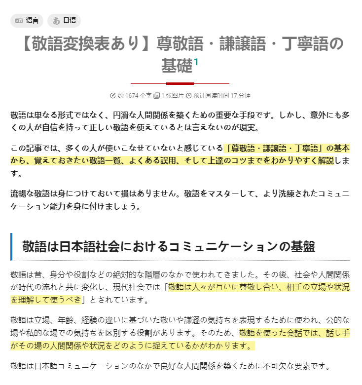
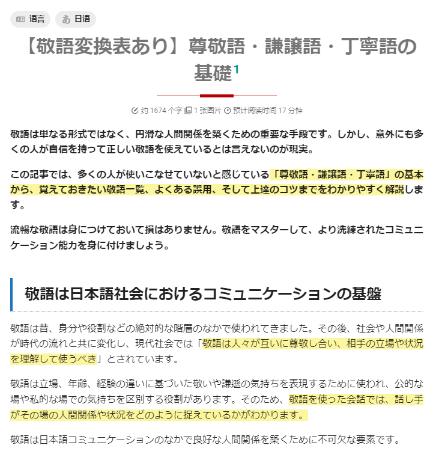

# mkdocs-add-lang
A plugin used to add "lang" to content body for better rendering of CJK characters.

## Precaution

Plugin for personal use.<br />
Since I'm not quite good at coding, there might be bugs that I don't know how to fix.<br />
Hope that someone more proficient can rewrite the code.

## Installation

1. Clone the project;
2. Navigate to the directory;
3. Execute the command below to install the plugin:
   
   ``` sh
   pip install .
   ````

## Usage

* Add below contents to `plugins` section to enable / disable the function globally:
  
  ``` yml
  - plugins
    - addlang:
        global_enable: false
  ```
  
* Add metadata to the main article to set render language:
  
  ```
  ---
  lang: ja
  ---
  ```

If the function is globally enabled without setting `lang` inside metadata, render language will be set as `zh` by default.

## Effect

* Without the plugin (`lang` rendered as `zh` on my local system):

  

* With the plugin (`lang` set as `ja` in metadata):

  
